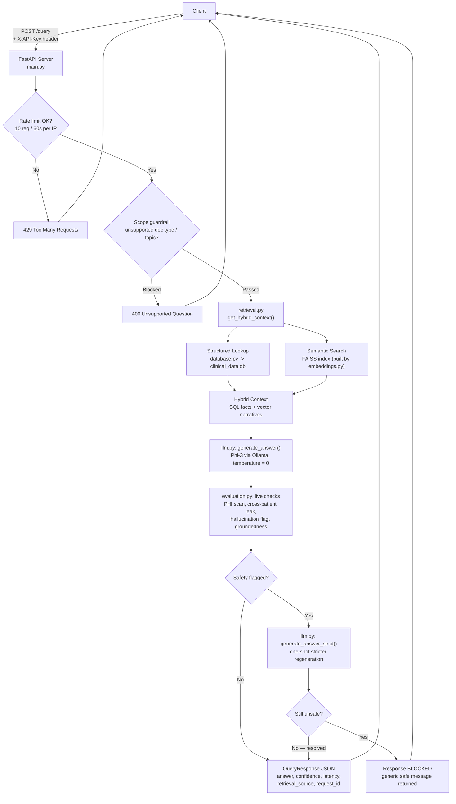
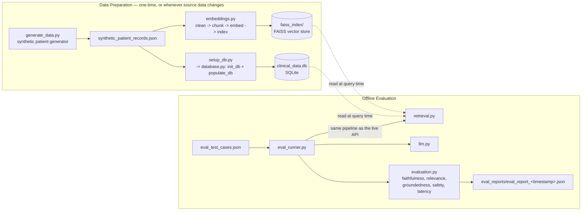

# 🩺 Med-RAG: Local Hybrid-Retrieval Medical Chatbot

A specialized Medical NLP Chatbot designed for high-accuracy clinical query answering. This system implements a Hybrid Retrieval-Augmented Generation (RAG) architecture, combining the precision of SQL with the semantic depth of Vector Search — with live safety enforcement and a built-in evaluation framework, not just a prompt and a vector store.

## 📖 Table of Contents

- [Purpose](#-purpose)
- [How This Differs From a Typical RAG Chatbot](#-how-this-differs-from-a-typical-rag-chatbot)
- [Architecture](#️-architecture)
- [Data Preparation & Offline Evaluation](#-data-preparation--offline-evaluation)
- [Project Structure](#-project-structure)
- [Retrieval Strategy](#-retrieval-strategy)
- [Chunking Strategy](#️-chunking-strategy)
- [Safety & Guardrails](#️-safety--guardrails)
- [Evaluation Framework](#-evaluation-framework)
- [API Reference](#-api-reference)
- [Project Setup & Usage](#-project-setup--usage)
- [Results](#-results)
- [Known Limitations & Roadmap](#-known-limitations--roadmap)
- [Summary](#-summary)

## 🎯 Purpose

Med-RAG answers clinical questions about a specific patient's visit history by grounding every answer in that patient's own records — nothing else. It exists as a reference implementation of what a **safety-conscious, fully local clinical RAG system** looks like: something teams can study or build on when they need hybrid retrieval, deterministic LLM guardrails, and automated evaluation, without sending patient data to a third-party API.

Given an MRD (Medical Record Number) and a natural-language question, the system returns a structured, confidence-scored answer that cites only what's actually present in the patient's SQL metadata and clinical notes — or explicitly returns `"No retrieval match"` rather than guessing.

## 🆚 How This Differs From a Typical RAG Chatbot

Most "RAG chatbot" walkthroughs stop at: embed documents, retrieve top-k chunks, stuff them in a prompt, done. Med-RAG adds several things most demo RAG projects skip entirely, and that matter specifically for clinical use:

1. **Hybrid retrieval, not just vector search.** Structured facts (patient identity, visit dates, doctors) come from deterministic SQL lookups (`database.py`), not from embeddings — asking an LLM to "remember" a discharge date via semantic similarity is the wrong tool for the job. Vector search (`embeddings.py` / FAISS) is reserved for what it's actually good at: unstructured note text.
2. **Live safety enforcement, not just a system prompt.** Every generated answer is scanned for PHI leakage and cross-patient information leakage *before* it's returned to the client. If a check fails, the system doesn't just log a warning — it regenerates the answer once with a stricter prompt, and blocks the response entirely if the violation persists (see the retry-then-block policy in `main.py`).
3. **A first-class evaluation framework, not an afterthought.** `evaluation.py` + `eval_runner.py` score faithfulness, answer relevance, hallucination, retrieval groundedness, and safety on every offline benchmark run — using the *same* scoring code that runs inline (fast, non-LLM checks only) on every live request, so live and offline behavior never drift apart. Most RAG demos ship with no eval story at all.
4. **100% local inference.** No OpenAI/Anthropic/cloud API calls anywhere in the pipeline — Phi-3 runs locally via Ollama, embeddings run locally via sentence-transformers. Nothing about a patient record leaves the machine.
5. **Deterministic by design.** `temperature=0`, a hard-coded refusal behavior (`"No retrieval match"`) when context doesn't support an answer, and explicit scope guardrails (billing/insurance/legal/imaging questions are rejected before they ever reach the LLM) — optimizing for predictability over creativity, which is the right tradeoff for clinical text.
6. **Built-in observability.** Structured logging throughout, a `/health` multi-component probe, and a `/metrics` endpoint (query counts, latency, confidence distribution, error breakdown) — production scaffolding most RAG demos don't bother with.

## 🏗️ Architecture



### Request flow, step by step

1. Client sends `POST /query` with an API key and `{mrd_number, query}`.
2. The per-IP rate limiter checks the request count (10/minute by default).
3. `retrieval.py` first checks scope guardrails (rejects imaging/billing/legal-type questions), then runs the SQL lookup and FAISS vector search and merges both into one context object.
4. `llm.py` sends that context plus the question to Phi-3 (temperature 0) and parses a structured `Answer: / Confidence:` response.
5. `evaluation.py`'s fast, non-LLM checks run inline on every request: PHI pattern scan, cross-patient leak check, hallucination flag (numbers/dates in the answer not present in the context), and groundedness.
6. If a safety check fails, one stricter regeneration is attempted; if it's still unsafe, the response is blocked and a generic safe message is returned instead of the model's output.
7. The client receives a structured response with the answer, confidence, latency, which retrieval path was used, and whether anything was flagged or blocked.

## 🧪 Data Preparation & Offline Evaluation



`eval_runner.py` deliberately reuses `retrieval.py`, `llm.py`, and `evaluation.py` unchanged — it exercises the exact same code path `main.py` uses live, so a benchmark result reflects what the API will actually do, not a separate test harness that can drift out of sync.

## 📁 Project Structure

| File | Role |
|---|---|
| `main.py` | FastAPI app — `/query`, `/health`, `/metrics` endpoints. Orchestrates retrieval → generation → live safety checks and implements the retry-then-block safety policy. |
| `retrieval.py` | Hybrid retrieval — combines SQL (`database.py`) and FAISS vector search (`embeddings.py`'s index) into one context dict. Also enforces the pre-retrieval scope guardrails (unsupported document types / topics). |
| `database.py` | Structured storage layer — SQLite schema, JSON ingestion, and per-MRD metadata lookups. |
| `embeddings.py` | Builds the FAISS vector index from clinical note text (HTML-cleaned, chunked, embedded). Run once before first use, and again whenever source records change. |
| `llm.py` | Wraps Ollama/Phi-3 calls — prompt construction, response format validation/repair, retries, token/latency logging, and the stricter "safety regeneration" prompt. |
| `evaluation.py` | Centralized scoring layer — faithfulness, answer relevance, hallucination flags, groundedness, PHI/cross-patient safety checks, and latency/throughput stats. Shared by the live API (fast checks) and the offline eval runner (full checks). |
| `eval_runner.py` | CLI offline benchmark — runs a batch of test cases through the full pipeline and writes a timestamped JSON report to `eval_reports/`. |
| `eval_test_cases.json` | The benchmark question set — currently 13 cases against the demo patient, including scope-guardrail and invalid-MRD edge cases. |
| `generate_data.py` | Synthetic patient-record generator — produces `synthetic_patient_records.json` with an internally-consistent diagnosis, notes, and specialty per patient (see the module docstring for why this matters). |
| `setup_db.py` | One-shot script that calls `init_db()` + `populate_db()`. **This is the actual entry point for database setup** — `database.py` itself has no `__main__` block, so running it directly does nothing. |
| `requirements.txt` | Python dependencies. |
| `synthetic_patient_records.json` | The demo dataset — one synthetic patient, five chronologically-spaced visits, all consistent with a single diagnosis. |
| `clinical_data.db` / `faiss_index/` | Generated data stores (SQLite DB, FAISS index). Not meant to be hand-edited — regenerate via `setup_db.py` / `embeddings.py` instead. |

## 🔍 Retrieval Strategy

The system employs a **Hybrid Retrieval Architecture** combining:

### 🧾 Structured (SQL)
- Stores patient metadata parsed from JSON records: MRD number, patient name, gender, doctor details, visit IDs, discharge dates, document types.
- Enables precise lookups and validation — a nonexistent MRD is rejected with a clear error before any LLM call happens.
- Retrieves **all historical visits for longitudinal analysis** (not just the most recent one).

### 🧠 Semantic Retrieval (Vector RAG)
- Clinical notes are embedded using `sentence-transformers` (`all-MiniLM-L6-v2`) and stored in FAISS.
- Retrieves the top-3 most relevant chunks per query: doctor observations, progress notes, treatment summaries, clinical descriptions.
- **Current limitation:** search runs across the whole index rather than being filtered to the requested MRD's chunks (fine with one demo patient; worth adding a metadata filter — `filter={"mrd_number": mrd_number}` — before indexing more than one).

### ⚙️ Query Execution Flow
1. **Guardrail check** → reject unsupported document types (imaging/scans) or topics (billing/insurance/legal) before any retrieval.
2. **MRD validation** → confirm the patient exists in `clinical_data.db`.
3. **Structured lookup** → fetch metadata + full visit history.
4. **Semantic search** → retrieve the most relevant clinical note chunks.
5. **Context synthesis** → merge SQL facts and vector narratives into one context object.
6. **Local inference** → generate an answer + self-assessed confidence score.
7. **Live safety scoring** → PHI/cross-patient/hallucination checks, with retry-then-block if a violation is detected.

✅ The **longitudinal approach** (step 3) improves accuracy by grounding answers in trends across multiple visits, not a single snapshot.

## ✂️ Chunking Strategy

Clinical notes are long and unstructured, so they're split before embedding:

- **Chunk size:** 500 characters
- **Overlap:** 50 characters

🎯 Benefits: better semantic retrieval, higher accuracy, and stronger grounding of LLM responses — clinical context (like symptoms and dates) isn't severed at a chunk boundary. Each chunk is embedded and stored independently in FAISS (`embeddings.py`).

## 🛡️ Safety & Guardrails

Clinical AI prioritizes **safety over creativity**. Guardrails run at two points: before retrieval even starts, and after the LLM has generated an answer.

### 🚧 Pre-retrieval scope guardrails (`retrieval.py`)
Cheap keyword checks on the incoming query, applied before any SQL or vector lookup:
- **Unsupported document types** — x-ray, MRI, CT scan, ultrasound, imaging, ECG, EEG. The system only analyzes text-based clinical notes.
- **Unsupported topics** — billing, insurance, payment, salary, claims, legal, lawsuit, staffing, inventory, equipment specs. Out of scope for a clinical assistant.

### 🔒 Live safety checks (`evaluation.py`, every request)
- **PHI pattern scan** — flags raw MRD numbers or date-like patterns appearing verbatim in the *answer* text (dormant SSN/phone/email patterns are also defined, ready for when the schema grows those fields).
- **Cross-patient leak check** — flags any MRD number or full name in the answer that doesn't match the requested patient.
- **Hallucination flag** (fast, non-LLM) — flags numbers/dates in the answer that don't appear anywhere in the retrieved context.
- **Faithfulness / answer relevance** (LLM-judged, offline only via `eval_runner.py` — too slow to run inline on every request) — Phi-3 itself grades whether the answer is fully supported by context, and whether it actually addresses the question asked.

### 🔁 Retry-then-block policy (`main.py`)
If the live PHI or cross-patient checks fail on the first answer:
1. Regenerate **once** with `generate_answer_strict()` — a stricter system prompt that explicitly forbids the detected violation type.
2. Re-run the safety check on the regenerated answer.
3. If it's now safe, return the regenerated answer. If it's **still** unsafe, block the response entirely and return a generic safe message — the violation details are always logged internally regardless of outcome.

### 📌 Response format & sample system prompt
```
Answer: <response>
Confidence: <High/Medium/Low>
```
```
You are a professional Medical AI Assistant. Use ONLY the provided context.
Rules:
1. If the question asks about "dates", "visits", or "history", analyze the context.
2. If the answer exists in the context, extract it directly.
3. If the context truly lacks the answer, say "No retrieval match."
4. Do not use outside knowledge.
5. Always output:
   Answer: <response>
   Confidence: <High/Medium/Low>
```

✅ Together these ensure hallucination-resistant, PHI-safe, traceable answers — with a documented fallback path when something still goes wrong.

## 📊 Evaluation Framework

`evaluation.py` and `eval_runner.py` together form the benchmarking layer — the piece most RAG demos skip. Every offline run scores each test case across four categories:

| Category | Metric | What it catches |
|---|---|---|
| Generation | `faithfulness` (LLM-judged, 0–1) | Does the answer only state facts present in the retrieved context? |
| Generation | `answer_relevance` (LLM-judged, 0–1) | Does the answer actually address the question asked? |
| Generation | `hallucination_check` (rule-based) | Numbers/dates in the answer that don't appear in the context. |
| Retrieval | `groundedness` (keyword-overlap proxy) | Silent retrieval failures — vector search returning semantically-near but off-topic chunks. |
| Safety | `safety_eval` | PHI pattern leaks and cross-patient information leaks. |
| System | `system_eval` | SQL / vector / LLM / total latency, and implied throughput (QPS). |

### Running it
```bash
python eval_runner.py                          # uses eval_test_cases.json
python eval_runner.py --test-file custom.json   # or a custom test set
```
Requires Ollama running locally with `phi3` pulled — both answer generation *and* the LLM-judge scoring call out to it. Each run writes `eval_reports/eval_report_<timestamp>.json` containing per-case detail plus an aggregate `summary` block (`avg_faithfulness`, `avg_answer_relevance`, `avg_total_latency_ms`, `safety_pass_rate`, `hallucination_flag_rate`).

### Interpreting results
As a rough guide: `avg_faithfulness` or `safety_pass_rate` below ~0.8, or any nonzero `hallucination_flag_rate`, is worth investigating before treating the system as reliable. Keep in mind the judge model is Phi-3 itself (self-grading) — see [Known Limitations](#-known-limitations--roadmap).

## 📡 API Reference

All endpoints except `/health` require an `X-API-Key` header. Set it via the `CLINICAL_RAG_API_KEY` environment variable before starting the server; it defaults to `dev-key-change-in-prod` if unset (change this before any real deployment).

### `POST /query`
Submit a clinical question for a given patient. Rate-limited to 10 requests/minute per IP.

**Request:**
```json
{
  "mrd_number": "20001",
  "query": "What is the patient's diagnosis?"
}
```

**cURL:**
```bash
curl -X POST "http://localhost:8000/query" \
     -H "Content-Type: application/json" \
     -H "X-API-Key: dev-key-change-in-prod" \
     -d '{"mrd_number": "20001", "query": "What is the patients diagnosis?"}'
```

**Response shape (illustrative):**
```json
{
  "request_id": "550e8400-e29b-41d4-a716-446655440000",
  "mrd_number": "20001",
  "answer": "The patient's diagnosis is Type 2 Diabetes.",
  "confidence": "High",
  "retrieval_source": "hybrid",
  "latency_ms": 842.3,
  "safety_flagged": false,
  "safety_details": {}
}
```
`safety_details` is populated only when something was blocked or hallucination-flagged; empty otherwise. Error responses (404 invalid MRD, 400 unsupported question, 500 LLM failure) all include a `request_id` for log correlation.

### `GET /health`
No API key required — safe for load balancer / uptime probes. Multi-component check (`llm`, `retrieval`) rolling up to an overall `healthy` / `degraded` / `unhealthy` status.

### `GET /metrics`
Requires `X-API-Key`. Live in-memory telemetry since the process started: total/successful/failed query counts, success rate, average latency, confidence distribution, and error-code breakdown. Resets on server restart — swap in Prometheus/Grafana for persistence.

### `GET /docs`
Interactive Swagger UI, auto-generated by FastAPI, at `http://127.0.0.1:8000/docs`.

## 🚀 Project Setup & Usage

### 1️⃣ Environment & Dependencies

```bash
python -m venv venv
```

On Windows:
```bash
.\venv\Scripts\activate
```
On macOS/Linux:
```bash
source venv/bin/activate
```

Install dependencies:
```bash
pip install -r requirements.txt
```

### 2️⃣ Local LLM Setup (Ollama)

This project uses Phi-3 for local inference.

```bash
ollama --version      # verify installation
ollama pull phi3      # pull the model
```

### 3️⃣ Data Initialization

Medical data is kept private and not tracked in this repo — run the ingestion scripts to generate your local SQLite database and FAISS vector index. A demo dataset (`synthetic_patient_records.json`, one patient, five visits) ships with the repo, so you can run these against it as-is, or regenerate it first:

```bash
python generate_data.py   # optional: regenerate the synthetic demo dataset
python setup_db.py        # populate the SQLite database (NOT `python database.py` — see Project Structure)
python embeddings.py      # build the FAISS vector index
```

### 4️⃣ Start the API Server

```bash
export CLINICAL_RAG_API_KEY="your-secret"   # optional — defaults to dev-key-change-in-prod
python main.py
```
The server runs at `http://127.0.0.1:8000`. Interactive docs: `http://127.0.0.1:8000/docs`.

### 5️⃣ (Recommended) Run the Evaluation Suite

```bash
python eval_runner.py
```
Review the generated report in `eval_reports/` before trusting the system's outputs — see [Evaluation Framework](#-evaluation-framework) above.

## 📈 Results

No benchmark run has been recorded in this repository yet — the metrics this framework produces (faithfulness, answer relevance, hallucination rate, groundedness, safety pass rate, latency) depend on a live Phi-3 model via Ollama, which isn't bundled with the repo itself.

To generate results: complete [setup steps 1–4](#-project-setup--usage), then run
```bash
python eval_runner.py
```
and paste the `summary` block from the newest file in `eval_reports/` here, e.g.:

```json
{
  "total_cases": 13,
  "successful": 13,
  "failed": 0,
  "avg_faithfulness": 0.0,
  "avg_answer_relevance": 0.0,
  "avg_total_latency_ms": 0.0,
  "safety_pass_rate": 0.0,
  "hallucination_flag_rate": 0.0
}
```
*(Placeholder shape shown above — replace with your actual run's numbers.)*

## ⚠️ Known Limitations & Roadmap

- **Single-patient demo dataset.** `synthetic_patient_records.json` currently contains one MRD across five visits. Cross-patient leak detection and multi-patient retrieval are structurally implemented but not yet exercised against real multi-patient data.
- **Vector search isn't scoped per-MRD.** `retrieval.py`'s `similarity_search` runs across the whole FAISS index rather than filtering by the requested patient's `mrd_number` metadata. Harmless with one patient in the index; should be fixed (`filter={"mrd_number": mrd_number}`) before adding more.
- **No ground-truth relevance labels.** Precision@k and MRR aren't computed for retrieval — only the keyword-overlap `groundedness` proxy is scored, since there's no labeled relevant-chunk set for this dataset.
- **Self-grading judge.** `evaluation.py`'s LLM-judge scores (faithfulness, relevance) use the same Phi-3 model that generates the answers being judged. Treat these scores as directional signal, not an independent audit.
- **Template-based synthetic notes.** `generate_data.py` builds clinical note text from fixed templates per diagnosis, not free-form LLM generation — consistent, but limited in linguistic variety. The module docstring flags this as a natural next upgrade.
- **`sqlalchemy` is an unused dependency.** It's listed in `requirements.txt` but the codebase currently talks to SQLite directly via the stdlib `sqlite3` module — likely reserved for a future ORM migration, not currently wired up.
- **In-memory metrics only.** `/metrics` resets on every server restart. For persistent monitoring, swap in Prometheus + Grafana or persist to `database.py`'s SQLite store.

## ✅ Summary

Med-RAG delivers a **fully local, privacy-first clinical AI system** that combines:

- **Structured SQL precision** for facts that shouldn't be left to semantic guesswork
- **Semantic vector intelligence** for grounding answers in unstructured clinical notes
- **Deterministic LLM outputs**, with explicit refusal behavior over speculation
- **Live safety enforcement** with a documented retry-then-block escalation path
- **A first-class evaluation framework** shared between live and offline code paths

➡️ **Result:** an accurate, explainable, and safety-checked medical query answering system — designed to be read, benchmarked, and extended, not just demoed.
